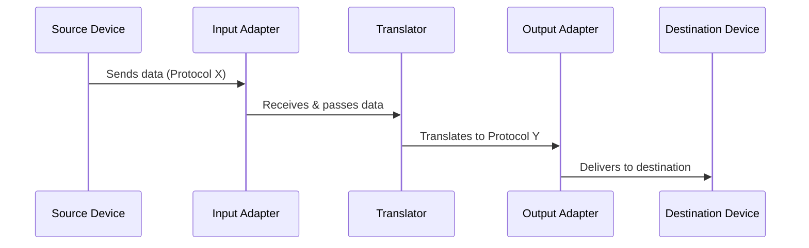
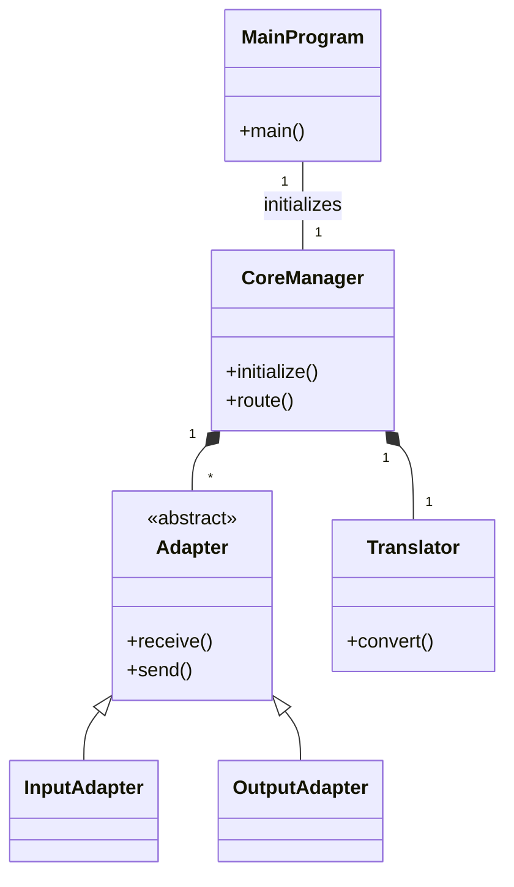

# A.E.T.H.E.R
*Autonomous Embedded Translation & Host Environment Router*

---

## 🚀 Overview

**A.E.T.H.E.R** is a robust C++ framework that automates translation and dynamic routing of data and commands between diverse embedded devices and host environments. Optimized for real-time systems and resource-constrained hardware, it provides seamless protocol interoperability across IoT, automation, and industrial control.

---

## ✨ Features

- **Autonomous Protocol Translation** — Converts data across multiple protocols automatically.
- **Embedded & IoT Focus** — Lightweight and reliable for real-time and constrained environments.
- **Dynamic Routing** — Flexible message routing driven by configuration or runtime logic.
- **Modular Design** — Easily add new adapters or protocol translators.
- **Verbose Logging & Diagnostics** — Track states, interactions, and errors in detail.

---

## 📐 Architecture

### Mermaid Diagram (GitHub compatible)


### ASCII Diagram (always shows)
```
+-------------------+        +---------------+        +-----------+        +-----------------+        +-------------------+
| Host Device/Server| ---> | Input Adapter | ---> | Translator| ---> | Output Adapter  | ---> | Embedded Devices  |
+-------------------+        +---------------+        +-----------+        +-----------------+        +-------------------+
          Protocol X                |                   Converts                |        Protocol Y
```

---

## 🔄 Data Workflow



---

## 🏗️ Internal Module Structure



---

## 📖 Operations Manual

### 1. Setup

**Prerequisites:**
- C++11 (or later) compiler  
- (Optional) [CMake](https://cmake.org/) for build management  
- Platform/SDK drivers for embedded hardware (if needed)

**Clone and Build:**
```bash
git clone https://github.com/DP1110/A.E.T.H.E.R.git
cd A.E.T.H.E.R
g++ -std=c++11 -o aether src/main.cpp
# or if CMake is provided:
cmake .
make
```

### 2. Configuration

Create a YAML configuration file (e.g., `config.yaml`):

```yaml
input_adapters:
  - protocol: UART
    port: /dev/ttyS2
output_adapters:
  - protocol: TCP
    address: 192.168.0.8
    port: 12000
translations:
  - from: UART
    to: TCP
    encoding: utf-8
routes:
  - from: "Input Adapter 1"
    to: "Output Adapter 1"
    condition: "payload.type == 'status_update'"
```

**Key fields:**  
- `protocol` – Supported: `UART`, `SPI`, `CAN`, `TCP`, etc.  
- `port` or `address` – Hardware/comms endpoint  
- `translations` – Defines mapping and conversions  
- `routes` – Logic to drive destination(s) for each message

### 3. Running

**Basic command:**
```bash
./aether --config config.yaml
```
**Options:**  
- `--config <file>`: Use configuration YAML/JSON file  
- `--verbose`      : Enable detailed logging output  
- `--dry-run`      : Validate configuration without committing changes  
- `--version`      : Display program version

### 4. Example Use Case

Suppose you need to link a UART sensor (Embedded Device) to a remote server via TCP.

- Configure input (UART) and output (TCP) adapters in your `config.yaml`
- Define translation from UART data packet to a TCP protocol message
- Start the application:
    ```bash
    ./aether --config config.yaml --verbose
    ```
- A.E.T.H.E.R listens to the UART port, translates all incoming packets, and sends them via TCP to your server.

### 5. Troubleshooting & Tips

- Use `--dry-run` to check your configuration file for errors.
- Inspect logs to track real-time protocol translation and routing activity.
- Add new adapters or translators by following the class structure shown in the diagrams.
- Test each connection (UART/TCP/etc) independently before full integration.

---

## ⚙️ Advanced Usage

- **Custom Adapters:**  
  Extend the `Adapter` abstract base class for proprietary protocols.
- **Complex Routing:**  
  Use logical expressions in `routes.condition` to drive dynamic or multi-target routing.
- **Performance Tuning:**  
  Toggle log verbosity, buffer sizes and timeout values in config for optimal performance in embedded deployments.

---

## 🤝 Contributing

1. Fork the repository  
2. Create your branch (`git checkout -b feature/YourFeature`)  
3. Commit changes  
4. Push (`git push origin feature/YourFeature`)  
5. Open a Pull Request against the main branch

---

## 🧩 Support

- [GitHub Issues](https://github.com/DP1110/A.E.T.H.E.R/issues) for bug reports and feature requests.
- For professional/commercial support, contact the repository maintainer.

---

## 📝 License

**Specify your license type here (e.g., MIT, GPLv3, Apache 2.0).**

---

## 📚 Additional Resources

- See `/docs` for protocol-specific integration examples (if available).
- Refer to [GitHub Discussions](https://github.com/DP1110/A.E.T.H.E.R/discussions) for Q&A and community tips.

---

*This README includes Mermaid diagrams: see https://docs.github.com/get-started/writing-on-github/working-with-advanced-formatting/creating-diagrams#creating-mermaid-diagrams for compatibility and rendering guidance.*
